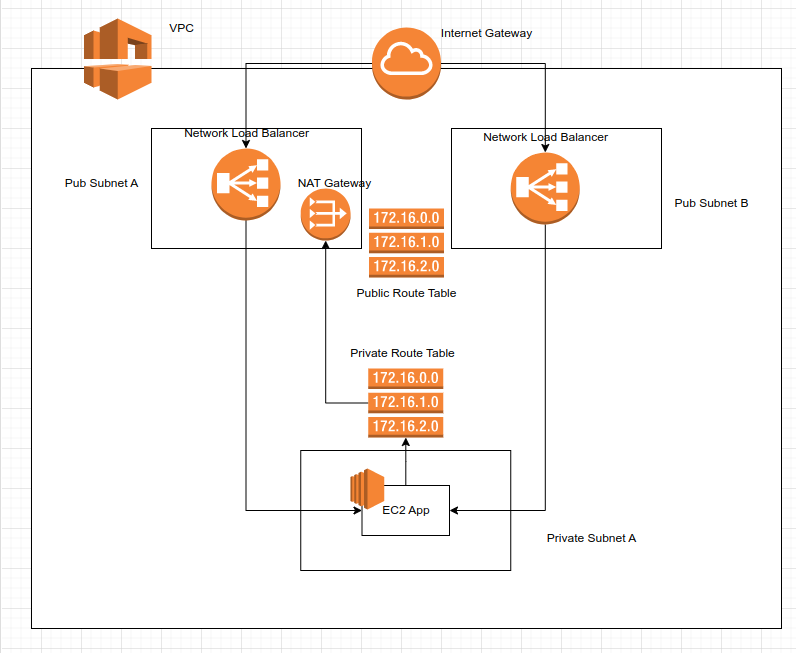
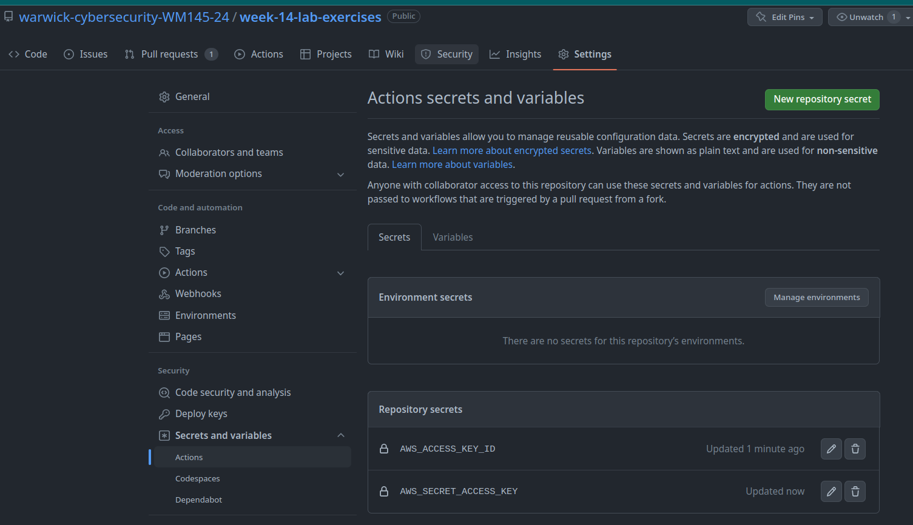

# Week 14

CI and CD

## Project structure

- `insecure/` a nodejs project with insecure dependencies
- `mashup/` some messed up JS
- `unittesting/` some unit tested js

## Links

see [Github Actions, Getting started](https://docs.github.com/en/actions/quickstart)
## Your mission

1. [ ] Get CI to test for insecure modules
    1. [ ] Fix issues
    1. [ ] recommit
1. [ ] Get CI to detect messed up JS
    1. [ ] Fix issues
    1. [ ] recommit
    1. [ ] Mash it up again
    1. [ ] recommit
1. [ ] Get CI to run unit testing
    1. [ ] Fix issues
    1. [ ] recommit
    1. [ ] Add a new test case for Bulgarian
    1. [ ] recommit
1. Create a new project called `combined/` which outputs a
hello greeting depending on the language you pass in the url
    1. [ ] It must lint
    1. [ ] It must check for known security vulns in dependencies
    1. [ ] It must run unit tests for new languages
1. Add secrets scanning (`git-secrets`? `talisman`?)

## Session 15 todo

### Objective get networking and CI working

- [ ] Create VPC: `10.0.0.0/22`
- [ ] Get Github actions to deploy your IaC

- [ ] Create Pub subnets:
  - [ ] a: `10.0.0.0/24`
  - [ ] b: `10.0.1.0/24`
- [ ] Create Pvt Subnets:
  - [ ] a: `10.0.2.0/24`
- [ ] Create IGW
- [ ] Create Public Route Tables
- [ ] Create NAT gateway
- [ ] Create Private Route Table

### Objective create secondary infra

- [ ] Clickops a `t3.micro` instance in a public subnet with port 22 open and ssh in
- [ ] Delete that instance and script a `t3.micro` instance into the private subnet
- [ ] Create Network load balancer (NLB)
- [ ] Connect load balancer to instance
- [ ] Deploy application to private instance

